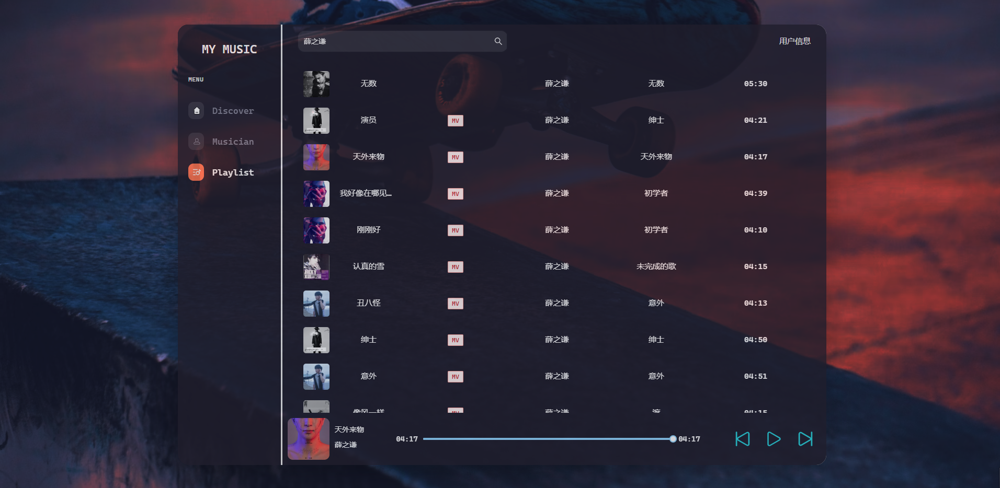

# Introduction

- 学习 React TypeScript Mobx ReactRouter
- 使用 audio，自定义 audio

# Install Project

```
git clone git@github.com:pkc918/react_music.git

cd react_music
yarn install
yarn start
```

# Rendering



